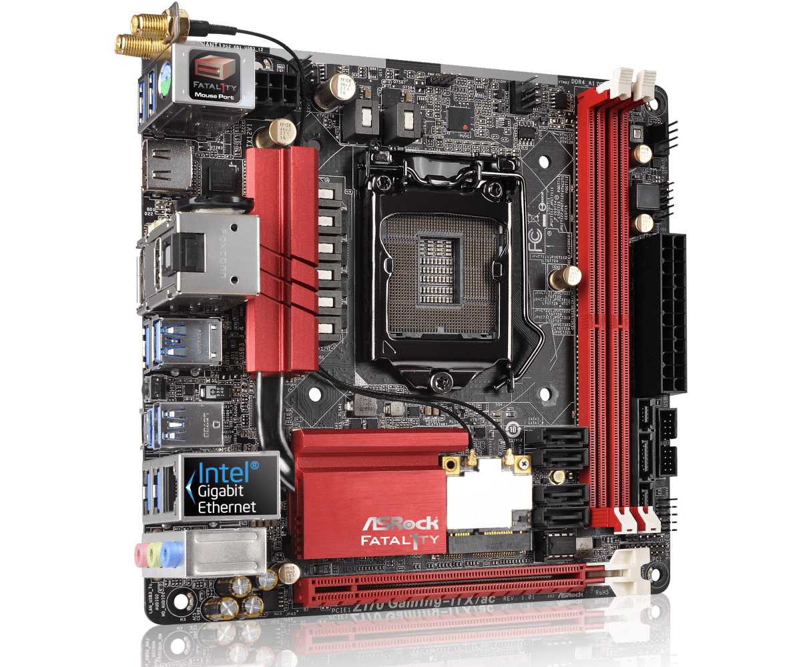
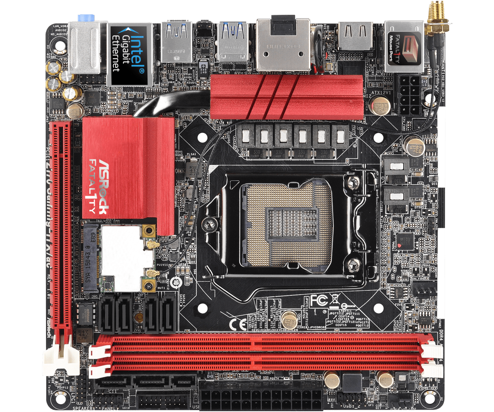

## AsRock Fatal1ty Z170 Gaming-ITXac

### Specs

- Audio: 7.1 CH HD Audio (Realtek ALC1150 Audio Codec)
- LAN: Intel Intel I219V 10/100/1000 Mb/s
- WiFi: Intel 2T2R Dual Band 802.11ac WiFi + BT v4.0 Module
- 1 x Ultra M.2 Socket, supports M Key type 2260/2280 M.2 SATA3 6.0 Gb/s
- 1 x Half-size Mini-PCI Express Slot: For WiFi + BT Module
- 1 x PCI Express 3.0 x16 Slot (PCIE1: x16 mode) 

## Gallery

 

#### Motherboard Overview 

   

#### Motherboard FrontView 

   

#### Motherboard I/O 

   
