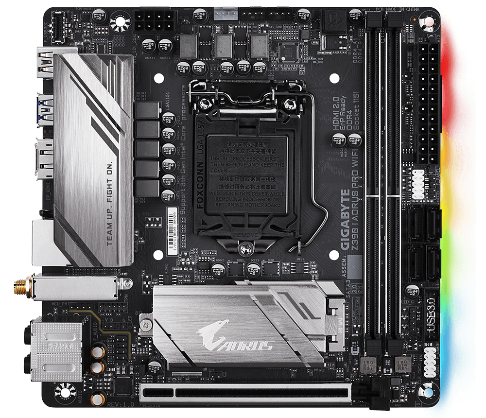

## Z390 I AORUS PRO WIFI 

### Specs

- Audio: Realtek® ALC1220-VB codec
- LAN: Intel GbE LAN chip (10/100/1000 Mbit)
- WiFi: Intel CNVi interface Wi-Fi 802.11a/b/g/n/ac, supporting 2.4/5 GHz Dual-Band
- BLUETOOTH 5
- 1 x M.2 Socket 1 connector for an Intel® CNVi wireless module only (CNVI)
- 1 x M.2 connector (Socket 3, M key, type 2242/2260/2280 SATA and PCIe x4/x2 SSD support) (M2P)
- 1 x M.2 connector on the back of the motherboard (Socket 3, M key, type 2260/2280 SATA and PCIe x4/x2 SSD support) 

## Gallery

 

#### Motherboard Overview 

   

#### Motherboard FrontView 

   

#### Motherboard I/O 

   

#### Motherboard Overall 

   
