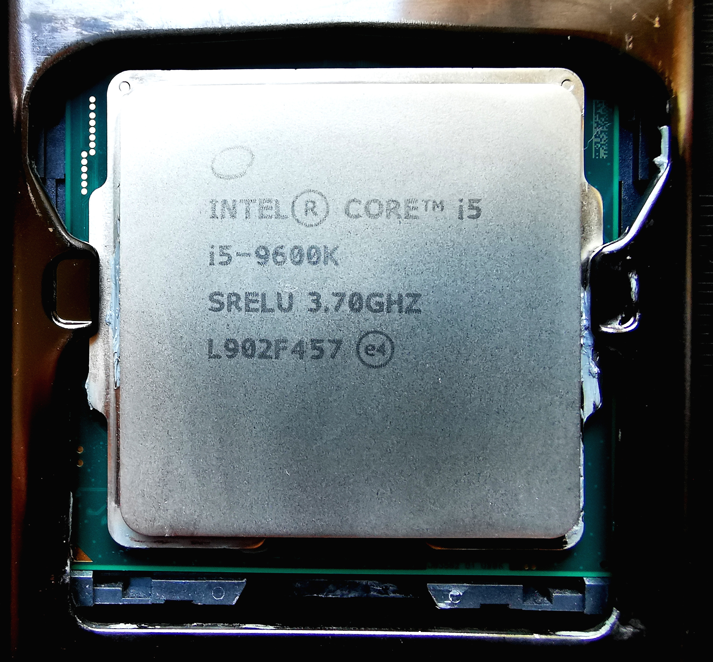
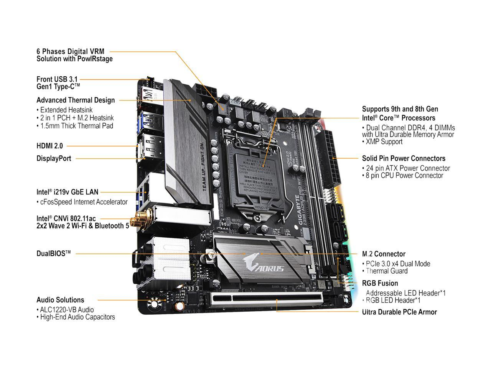
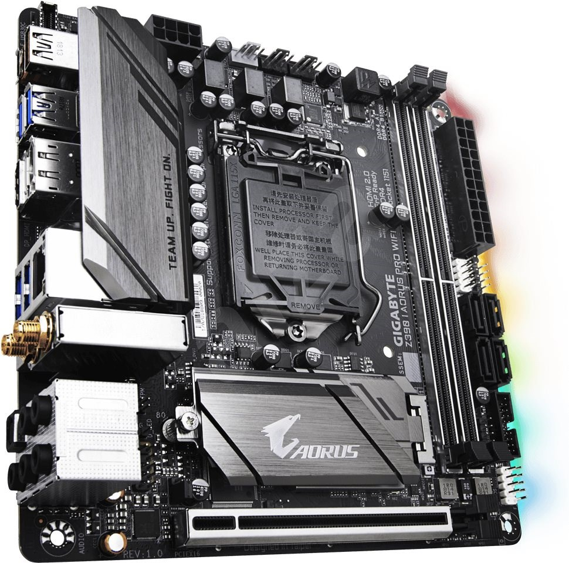
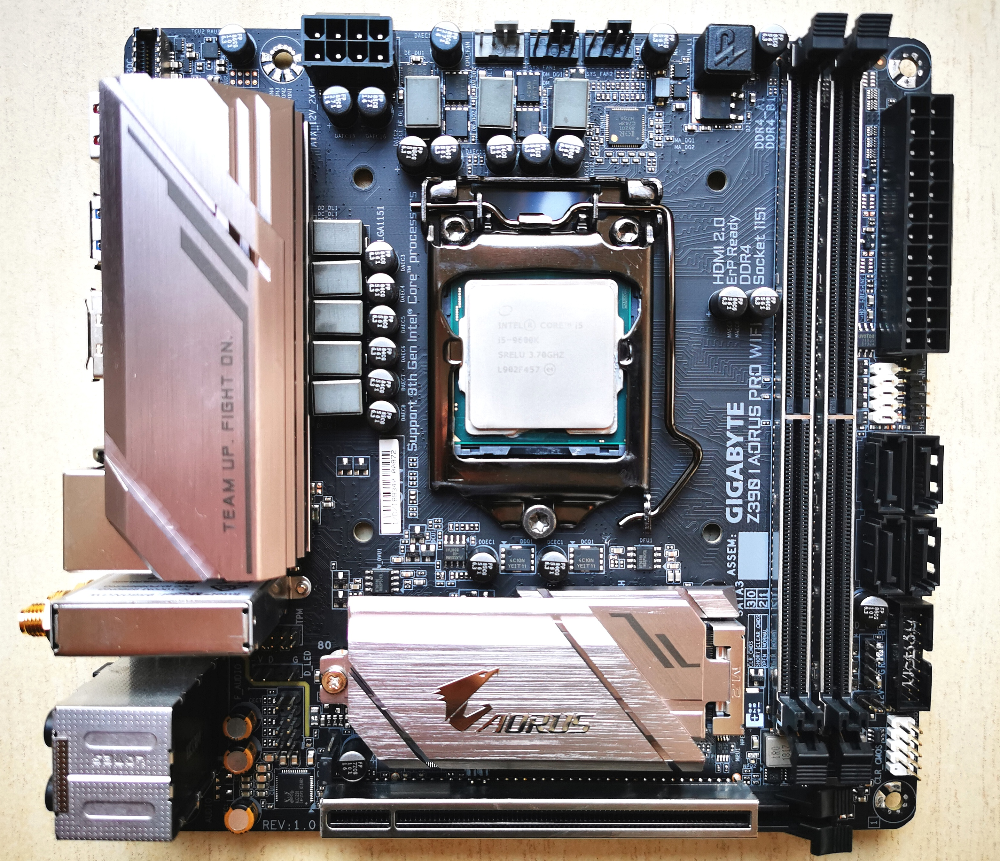
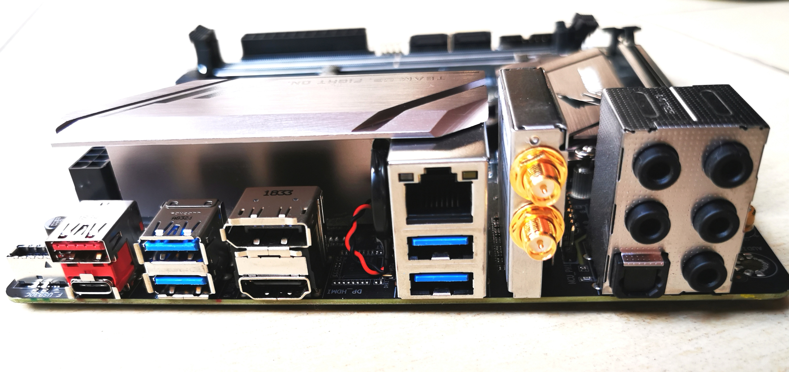

## System Hardware Info

### CPU

- CPU - Intel(R) Core(TM) i5-9600K CPU @ 3.70GHz
- Intel Generation: Coffee Lake
- Platform ID: 0x3E9B0007

  

### IGPU

- GPU Name: Intel CoffeeLake-S GT2 [UHD Graphics 630]
- GPU Device ID: 0x3E988086
- Total VRAM: 1536 MB

  

### Storage

- Plain SATA SSD: Samsung SSD 850 EVO 256gb

  

### Memory

- Kingston 1x16gb ddr4 2133Mhz KVR21N15D8/16

  

### Motherboard Gygabyte aorus z390 I Pro ITX

- Gygabyte Aorus z390I Pro ITX 
- Chipset: Intel® Z390 Express Chipset
- Audio: Realtek ALC1220-VB codec
- LAN: Intel Gigabit Ethernet
- WiFi: Disabled

  

### Gallery

 

  

  

  

  
